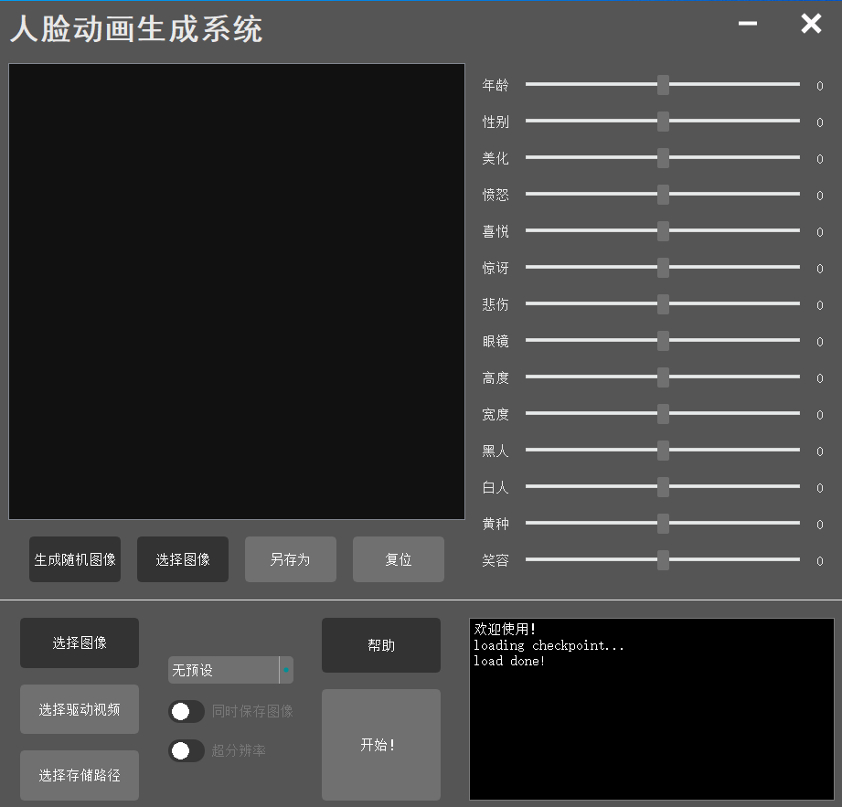
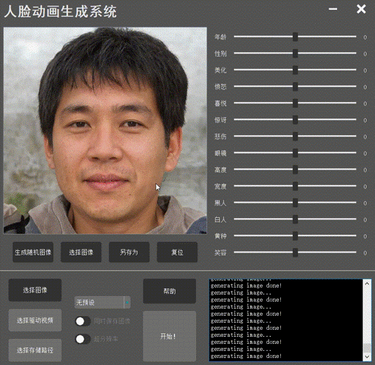
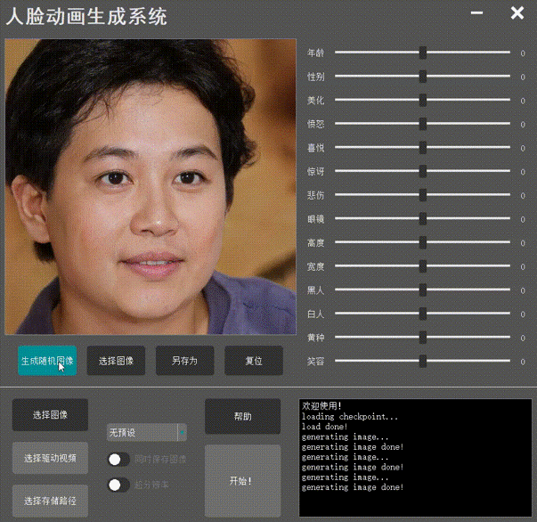

# FAS(Face Animation System)

#### It may take a while to load all images.

### Quick start

1. cuda 10.x is recommended, while cuda 11.x / 12.x have not been tested for stylegan2

2. refer to env.yaml to create the environment or use this command below:

   ```conda env create -n fas -f env.yaml```
   
   if any problem occurred, please install specific packages manually, then run

   ```conda activate fas```

3. get checkpoints:
   https://pan.quark.cn/s/350c14d48e34

   put them all in ./checkpoints

4. run the main.py 

   ```python main.py```

   you can get the main window as below:

 

### Example

Here are some examples: 

<p align="center">
  
  
  
</p>

<p style="text-align: center;" align='center'>
  <span style="display: inline-block; width: 256px;" width='256'>source ||</span>
  <span style="display: inline-block; width: 256px;" width='256'>result1 ||</span>
  <span style="display: inline-block; width: 256px;" width='256'>+smile</span>
</p>

<p align="center">
  
  
  
</p>

<p style="text-align: center;" align='center'>
  <span style="display: inline-block; width: 256px;" width='256'>result2 ||</span>
  <span style="display: inline-block; width: 256px;" width='256'>-age ||</span>
  <span style="display: inline-block; width: 256px;" width='256'>+age +glass</span>
</p>

Examples with UI:


<p align='center'>
    <p align='left' style="font-size: 20px;"><span>To generate different faces:</span></p>
    <p align='center'></p>
    <p align='left' style="font-size: 20px;"><span>To adjust face attributes:</span></p>
	<p align='center'></p>
    <p align='left' style="font-size: 20px;"><span>To generate face videos:</span></p>
    <p align='center'></p>
</p>

### Contributor

Gratitude to Senior Song Jiapeng for his invaluable assistance! 

Acknowledgments to the contributors of https://github.com/a312863063/generators-with-stylegan2 

Special thanks to the contributors of https://github.com/AliaksandrSiarohin/first-order-model

### License

The project is licensed under the [Apache License 2.0] - Please refer to the [LICENSE] file for detailed information.